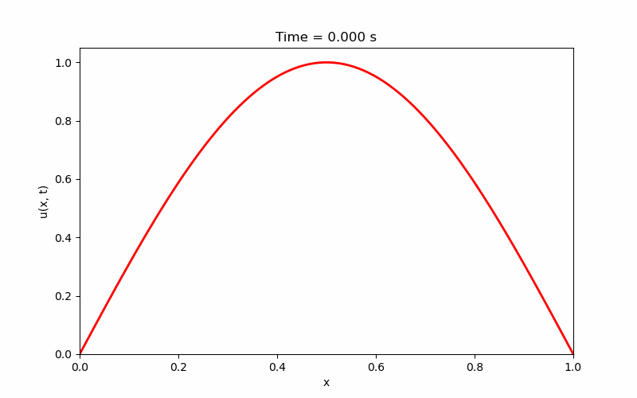
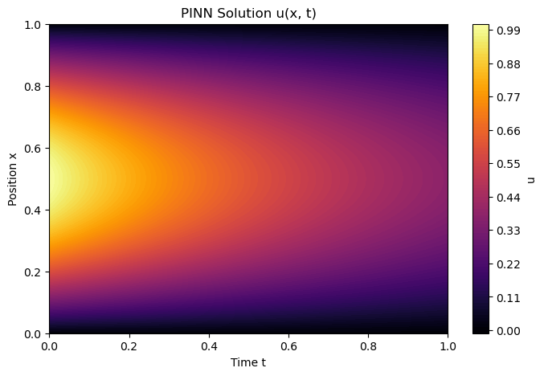

# **Documentation**

**Author:** Tobias Safie<br>
**Advisor:** Dr. Niharika Sravan<br>
**Department:** Physics; Economics<br>
**Tags:**  Physics, Astrophysics, Finance, Quantitative Finance, Machine Learning, PINN, PDEs, Options Pricing, PyTorch, Torchdyn


## **Timeline**
### **Week 0** - _Preliminary Reading_
Before this point, my relevant experience was limited to approximating ODEs, and utilizing Pandas, NumPy, and SciPy through both my own coursework (_Contemporary Physics I-III_; _Computational Physics I_) and personal projects ([_Urban Displacement Mapping_](https://github.com/tobiassafie/reverse-redlining); [_Live Market Backtester + Simulation_](https://github.com/tobiassafie/quant-backtester)). So to get myself up to speed, I began studying methods of approximating PDE solutions, primarily Runge-Kutta (RK) methods, Euler methods, Fourier Neural Operators (FNOs), and Physics-Informed Neural Networks (PINNs). I familiarized myself with these methods and set goals for the project. I also worked through some elementary PDEs and selected the **1D Heat Diffusion PDE** to be our main test case.

<center>
    
$\frac{\partial u}{\partial t} = D \frac{\partial^2 u}{\partial x^2}$

</center>

### **Week 1** - _Build Tools; Trial with Test Cases_
Per the schedule, I built three notebooks to evaluate our test case: a **Homemade RK4 Solver**, a **SciPy PDE Solver**, and two **PINNs**. They all approximated the PDE incredibly accurately-- all within a fourth order of magnitude. These tools were more for learning purposes, but they may be quantitatively benchmarked at a laterpoint. Each one of these tools were documented in notebooks in the [dev_notebooks](./dev_notebooks/) folder.
<p align="center">
    
    
</p>

New additions:

```
STAR/
├── dev_notebooks/
│   ├── homemade_rk4_diffusion.ipynb
│   ├── nn_diffusion.ipynb
│   └── scipy_integration_diffusion.ipynb
├── media/
│   ├── 1D_diffusion_heatmap_pinn.png
│   └── 1D_diffusion.gif
├── documentation.md
└── README.md
```


### **Week 2** - _Scale up PINN Solver_
