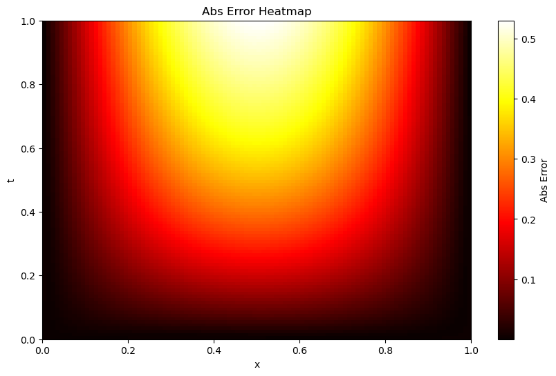

# **Documentation**

**Author:** Tobias Safie<br>
**Advisor:** Dr. Niharika Sravan<br>
**Department:** Physics; Economics<br>
**Tags:**  Physics, Astrophysics, Finance, Quantitative Finance, Machine Learning, PINN, PDEs, Kilonova, Options Pricing, PyTorch, Torchdyn


## **Timeline**
### **Week 0** - _Preliminary Reading_
Before this point, my relevant experience was limited to approximating ODEs, and utilizing Pandas, NumPy, and SciPy through both my own coursework (_Contemporary Physics I-III_; _Computational Physics I_) and personal projects ([_Urban Displacement Mapping_](https://github.com/tobiassafie/reverse-redlining); [_Live Market Backtester + Simulation_](https://github.com/tobiassafie/quant-backtester)). So to get myself up to speed, I began studying methods of approximating PDE solutions, primarily Runge-Kutta (RK) methods, Euler methods, Fourier Neural Operators (FNOs), and Physics-Informed Neural Networks (PINNs). I familiarized myself with these methods and set goals for the project. I also worked through some elementary PDEs and selected the **1D Heat Diffusion PDE** to be our main test case.

$$ \frac{\partial u}{\partial t} = D \frac{\partial^2 u}{\partial x^2} $$
    
### **Week 1** - _Build Tools; Trial with Test Cases_
Per the schedule, I built three notebooks to evaluate our test case: a **Homemade RK4 Solver**, a **SciPy PDE Solver**, and two **PINNs**. They all approximated the PDE incredibly accurately-- all within a fourth order of magnitude. These tools were more for learning purposes, but they may be quantitatively benchmarked at a laterpoint. Each one of these tools were documented in Jupyter notebooks in the [dev_notebooks](./dev_notebooks/) folder.
<table align="center">
  <tr>
    <td align="center">
      <br>
      <em>Evolution of diffusion over time. SciPy RK45.</em>
    </td>
    <td align="center">
      <br>
      <em>Heatmap of solutions u. PINN 1.0.</em>
    </td>
  </tr>
</table>

New additions:

```
STAR/
├── dev_notebooks/
│   ├── homemade_rk4_diffusion.ipynb
│   ├── nn_diffusion.ipynb
│   └── scipy_integration_diffusion.ipynb
├── media/
│   ├── 1D_diffusion_heatmap_pinn.png
│   └── 1D_diffusion.gif
├── documentation.md
└── README.md
```


### **Week 2** - _Scale up PINN; Scaffold Benchmarking Tools_
This week, I fleshed out benchmarking tools before scaling up the PINN. Although already on our agenda for the week, I found it salient to evaluate the accuracy of our **first PINN** (PINN 1.0). The backbone of this benchmarking is **Pandas dataframes.** They are lightweight, easy to index and edit and are industry standard for large-scale data analysis. Learning how to handle these large data sets of points was difficult, for a multitude of reasons. The biggest issue is to make sure each solver is evaluating the same points; with the np.linspace function, there are often roudning errors that may make two separate dataframes incompatible due to rounding errors from two separate np.linspace calls, despite being identical. Then it's simply up to organization and proper data evaluation, analysis, and how we want to manipulate the dataframe to actually be useful. Ultimately, PINN 1.0 wasn't nearly as accurate as I originally hoped, but it opened paths to finding better and different ways to hyperparameterize our PINN. With the benchmarking process fleshed out we can package it into a script once we have more complex PINNs.
<table align="center">
    <tr>
        <td align="center">
            <br>
            <em>Heatmap illustrating the absolute error. PINN 1.0 1D Diffusion.</em>
        </td>
    </tr>
</table>

During our weekly meeting, we also discussed ways to optimize the hyperparameters of a neural network. I originally was planning to intuitively guess and check for better hyperparameters, however I was introduced to **GridSearchCV**, a technique that systematically tunes the hyperparameters of a neural net. There are also other search tools such as **Random Search**, but I'll start off with Grid Search next week.
<br><br>

New additions:
```
STAR/
├── dev_notebooks/
│   └── benchmark_demo.ipynb
├── media/
│   └── 1D_diffusion_abserr_heatmap_01.png
└── data/
```


### **Week 3** - _Implement GridSearchCV; Scale up PINN w/ Kilonova Model_
This week, 