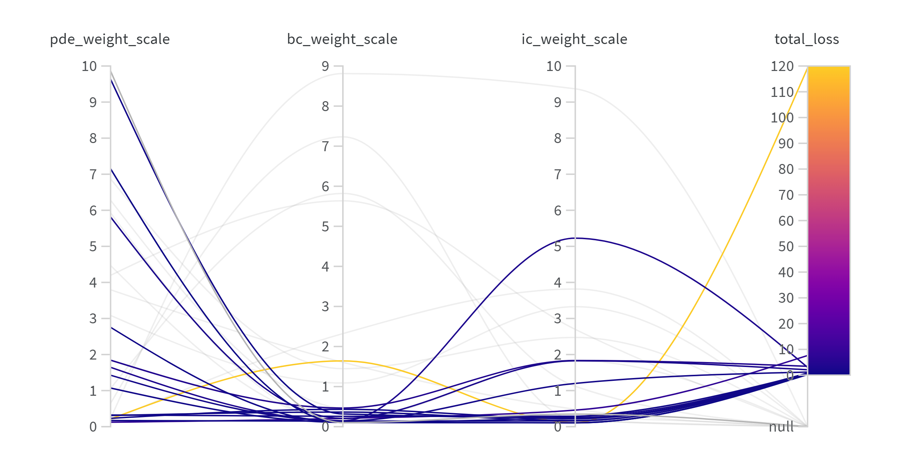

# **Documentation**

**Author:** Tobias Safie<br>
**Advisor:** Dr. Niharika Sravan<br>
**Department:** Physics; Economics<br>
**Tags:**  Physics, Astrophysics, Finance, Quantitative Finance, Econophysics, Machine Learning, PINN, PDEs, Kilonova, Options Pricing, PyTorch


## **Timeline**
### **Week 0** - _Preliminary Reading_
---
Before this point, my relevant experience was limited to approximating ODEs, and utilizing Pandas, NumPy, and SciPy through both my own coursework (_Contemporary Physics I-III_; _Computational Physics I_) and personal projects ([_Urban Displacement Mapping_](https://github.com/tobiassafie/reverse-redlining); [_Live Market Backtester + Simulation_](https://github.com/tobiassafie/quant-backtester)). So to get myself up to speed, I began studying methods of approximating PDE solutions, primarily Runge-Kutta (RK) methods, Euler methods, Fourier Neural Operators (FNOs), and Physics-Informed Neural Networks (PINNs). I familiarized myself with these methods and set goals for the project. I also worked through some elementary PDEs and selected the **1D Heat Diffusion PDE** to be our main test case.

---

$$ \frac{\partial u}{\partial t} = D \frac{\partial^2 u}{\partial x^2} $$
<center>

**1D Diffusion**
</center>

Where:
* $u$: Concentration/Temperature
* $t$: Time
* $x$: Position
* $D$: Constant of Diffusion

    
<br>
<br>

### **Week 1** - _Build Tools; Trial with Test Cases_
---
Per the schedule, I built three notebooks to evaluate our test case: a **Homemade RK4 Solver**, a **SciPy PDE Solver**, and two **PINNs**. They all approximated the PDE incredibly accurately-- all within a fourth order of magnitude. These tools were more for learning purposes, but they may be quantitatively benchmarked at a laterpoint. Each one of these tools were documented in Jupyter notebooks in the [dev_notebooks](./dev_notebooks/) folder.

---
<table align="center">
  <tr>
    <td align="center">
      <br>
      <em>Evolution of diffusion over time. <br>SciPy RK45.</em>
    </td>
    <td align="center">
      <br>
      <em>Heatmap of solutions u. <br>PINN 1.0.</em>
    </td>
  </tr>
</table>

---
<br>

New additions:

```
STAR/
├── dev_notebooks/
│   ├── homemade_rk4_diffusion.ipynb
│   ├── nn_diffusion.ipynb
│   └── scipy_integration_diffusion.ipynb
├── media/
│   ├── 1D_diffusion_heatmap_pinn.png
│   └── 1D_diffusion.gif
├── documentation.md
└── README.md
```

<br><br>

### **Week 2** - _Scale up PINN; Scaffold Benchmarking Tools_
---
This week, I fleshed out benchmarking tools before scaling up the PINN. Although already on our agenda for the week, I found it salient to evaluate the accuracy of our **first PINN** (PINN 1.0). The backbone of this benchmarking is **Pandas dataframes.** They are lightweight, easy to index and edit and are industry standard for large-scale data analysis. Learning how to handle these large data sets of points was difficult, for a multitude of reasons. The biggest issue is to make sure each solver is evaluating the same points; with the np.linspace function, there are often roudning errors that may make two separate dataframes incompatible due to rounding errors from two separate np.linspace calls, despite being identical. Then it's simply up to organization and proper data evaluation, analysis, and how we want to manipulate the dataframe to actually be useful. Ultimately, PINN 1.0 wasn't nearly as accurate as I originally hoped, but it opened paths to finding better and different ways to hyperparameterize our PINN. With the benchmarking process fleshed out we can package it into a script once we have more complex PINNs.

---

<table align="center">
    <tr>
        <td align="center">
            <br>
            <em>Heatmap illustrating the absolute error. <br>PINN 1.0.</em>
        </td>
    </tr>
</table>

---

During our weekly meeting, we also discussed ways to optimize the hyperparameters of a neural network. I originally was planning to intuitively guess and check for better hyperparameters, however I was introduced to **GridSearchCV**, a technique that systematically tunes the hyperparameters of a neural net. There are also other search tools such as **Random Search**, but I'll start off with Grid Search next week.

---
<br>

New additions:
```
STAR/
├── dev_notebooks/
│   └── benchmark_demo.ipynb
├── media/
│   └── 1D_diffusion_abserr_heatmap_01.png
└── data/
```

<br><br>

### **Week 3** - _Determine Best Available Optimizers; Finetune Future Plans_
---
This week, there are the least amount of deliverables that we'll likely have all project. I spent the week researching different ways to optimize the hyperparameters for our PINN and, to my surprise, options were abundant. Although last week I figured **GridSearchCV** or **RandomSearch** would be our best ways to optimize and reduce errors of the approximations of our PINNs, I was introduced to many different tools. Every time I found what I thought would be the best tool at my disposal and began to implement it, I would stumble across a better one. After that, I managed to settle on [**Weights & Biases' Sweep Tool**](https://docs.wandb.ai/tutorials/sweeps/). It seemed like the best of every world with relatively simple implementation, modularity, and functionality. Due to the circuitous and tortuous nature of the week, I'll be reserving full implementation of the **Sweep Tool** for next week. However, we're not behind schedule in the slightest! When planning the project, my advisor and I agreed there would be speedbumps when it came to the neural network.

---
Due to the slow pace of this week, a significant task that was also tackled this week was planning. Now that we're in the process of moving past the learning stage, we'll likely be switching to modular or semi-modular scripts as opposed to Jupyter Notebooks. For a final deliverable, we'll either move into a new, completely unexplored use case for our PINN solver **OR** we'll create an interactive way to showcase our PINNs and their potential use cases in the future.

---
<br>

New additions:
```
STAR/
└── scripts/
```

<br><br>


### **Week 4** - _Tackle a Financial PDE_
This week, we wanted to create a PINN approximator of one of our financial PDEs used for **options evaluation/pricing**. In our project outline we looked at two different options evaluation PDEs: The first being the **Black-Scholes PDE**, a foundational and closed-from PDE that evaluates traditional European options.

---
$$
\frac{\partial V}{\partial t} + \frac{1}{2}\sigma^2 S^2 \frac{\partial^2 V}{\partial S^2} + rS \frac{\partial V}{\partial S} - rV = 0
$$
<center>

**Black-Scholes PDE**
</center>

Where:
* $V$: Option price
* $t$: Time
* $S$: Price of the underlying asset
* $\sigma$: Volatility of the underlying asset's returns
* $r$: Risk-free interest rate
---
The Black-Scholes equation, despite its importance and elegance, is still a very rudamentary way to evaluate options— assumes a constant known variance ($\sigma$). Because of this, the Black-Scholes has been modified many different ways to account for more complexity found in actual market dynamics. The modification we're looking at is the **Heston PDE**, a well-known PDE for more intricate options modeling. This PDE, as opposed to the former, is 3-dimensional and makes use of **two correlated Brownian motions**, **volatility clustering**, and **mean reversion**. Additionally, the equation is semi-closed and requires Fourier transformations to solve at given points which makes it computationally expensive and ideal for Deep Learning.

---


$$
\frac{\partial V}{\partial t} + rS \frac{\partial V}{\partial S} + \rho\sigma v S \frac{\partial^2 V}{\partial S \partial v} + \frac{1}{2}S^2 v \frac{\partial^2 V}{\partial S^2} + \frac{1}{2}\sigma^2 v \frac{\partial^2 V}{\partial v^2} + \kappa(\theta - v) \frac{\partial V}{\partial v} - rV = 0
$$
<center>

**Heston PDE**
</center>

Where:
* $V$: Option price (a function of $S$, $v$, and $t$)
* $t$: Time
* $S$: Price of the underlying asset
* $v$: Instantaneous variance of the underlying asset (volatility squared)
* $r$: Risk-free interest rate
* $\rho$: Correlation between the Brownian motion of the asset price and its variance
* $\sigma$: Volatility of the variance (volatility of volatility)
* $\kappa$: Rate at which the variance $v$ reverts to its long-term mean $\theta$
* $\theta$: Long-term mean variance

---

This week, I prioritized building a Black-Scholes RK4 numerical solver and PINN, before moving onto the Heston goliath. I wanted to benchmark the PINN's performance against a highly accurate numerical solver before I adapt the architecture for the Heston PDE. The Black-Scholes PINN served as a new challenge but the architecture was completed quickly. Much of the week's work consisted of various **Sweeps** and **hyperparameter fine-tuning**. The PINN should be finished early next week and the Heston PDE can be tackled shortly after, building directly on the architecture designed for the Black-Scholes. Our biggest goal will to reduce the initial condition loss and likely teach it the network better. Additionally, I also reorganized the directory slightly; each equation's relevant tools is in its own place. When we transition to clean scripts, the [dev_notebooks](./dev_notebooks/) folder can be easily navigated and my work easily readable.

---
<table align="center">
    <tr>
        <td align="center">
            <br>
            <em> <br>Map of loss weights tested via a series of bayesian sweeps<br>Black-Scholes PINN</em>
        </td>
    </tr>
</table>


### **Week 5** - _Tune our Black-Scholes PINN Solver_
This week has been a slower week. I spent the majority of this time learning about hyperparameter sweeps and what is the difference between a good model and a great model. There is little to talk about this week since it was primarily spent trying to push past a bottleneck I faced— sweeps and tuning. These sweeps take a lot of time and with each tweak, it felt like I was sacrificing some things for other things. For instance, I was able to greatly reduce the loss but the loss on the initial condition was not learning well. This lead to me running in circles before Dr. Sravan referred me to look at other architectures to take inspiration. This led me to studying LSTM, CNN, and Transformer architecture.


### **Week 6** - _Learning to Fix Our Issue_
I went into this week and still couldn't get past the bottleneck, I took a step back and evaluated my skillset— I was not where I needed to be knowledge-wise to tackle this problem. Because of this, Dr. Sravan gave me a short project for learning purposes. She gave me a broken Transformer Autoencoder and told me to study it and provide solutions on how to fix it. Although this may seem off-topic, this was exactly what I needed. Studying the architecture and becoming intimate with the code gave me a greater, almost fundamental understanding of these kind of models. Additionally, through this I learned how to use cloud-based training, TPU acceleration, and GPU/CPU handoff for model training. I also developed a BiLSTM with attention. I now feel ready to return to the Black-Scholes problem and to then adapt to the Heston PDE.